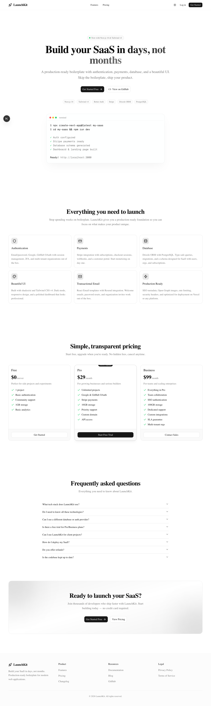
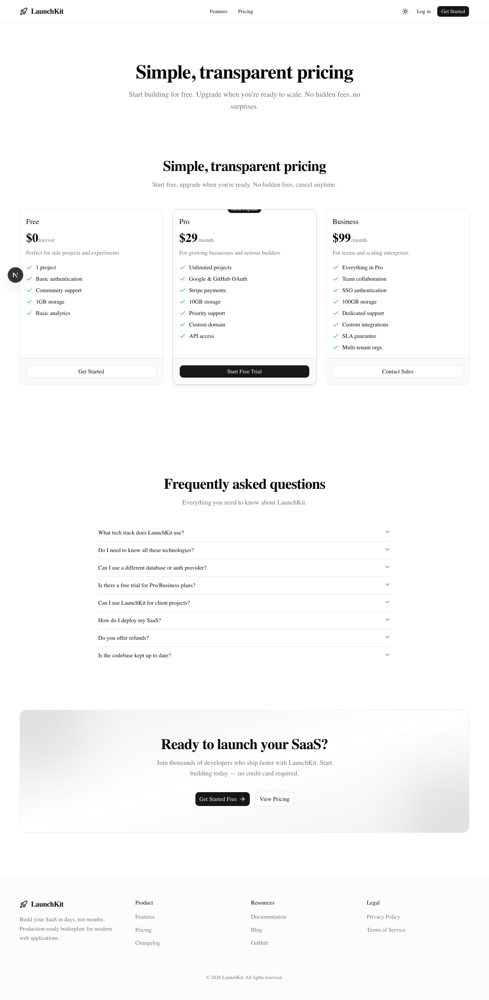
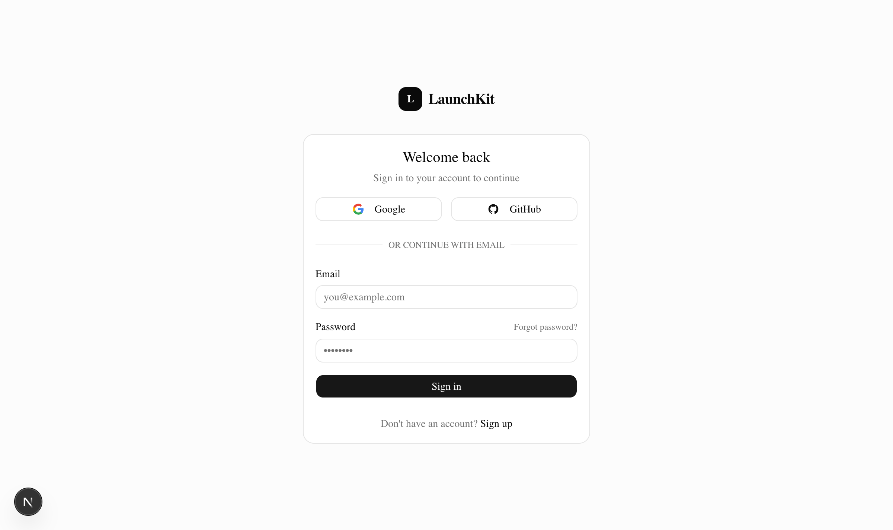
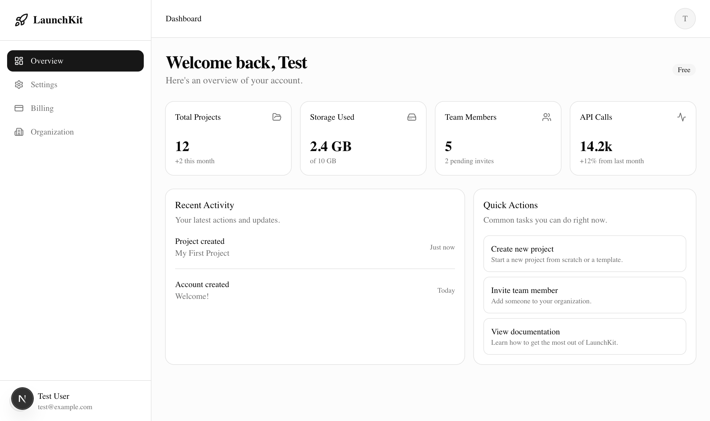
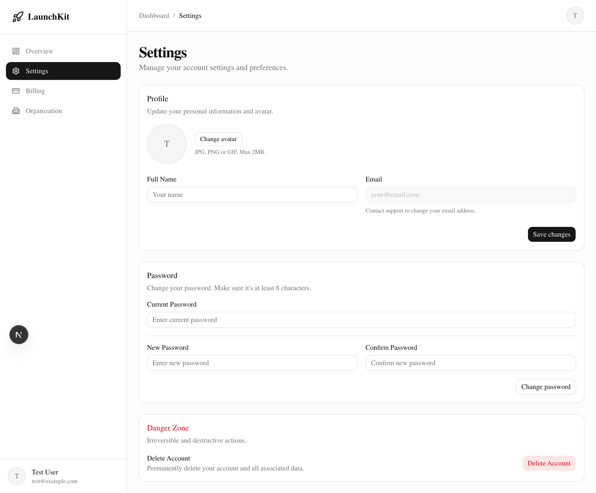
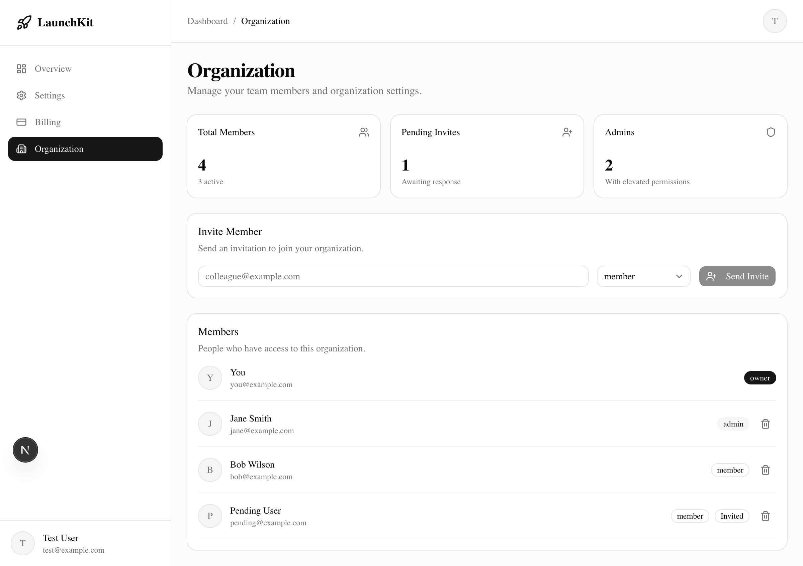

# LaunchKit

A production-ready SaaS boilerplate built with the latest technologies. Ship your SaaS product in days, not months.

[](https://vercel.com/new/clone?repository-url=https://github.com/nnrohu/launchkit&env=DATABASE_URL,BETTER_AUTH_SECRET,BETTER_AUTH_URL,STRIPE_SECRET_KEY,NEXT_PUBLIC_STRIPE_PUBLISHABLE_KEY,STRIPE_WEBHOOK_SECRET,STRIPE_PRO_PRICE_ID,STRIPE_BUSINESS_PRICE_ID,RESEND_API_KEY,NEXT_PUBLIC_APP_URL&envDescription=Required%20for%20auth%2C%20database%2C%20payments%2C%20and%20email&envLink=https://github.com/nnrohu/launchkit#quick-start)

## Tech Stack

- **Framework:** Next.js 16 (App Router, Turbopack)
- **Language:** TypeScript
- **Styling:** Tailwind CSS v4 + shadcn/ui
- **Auth:** Better Auth (email/password, Google, GitHub)
- **Database:** PostgreSQL + Drizzle ORM
- **Payments:** Stripe (subscriptions, checkout, webhooks)
- **Email:** React Email + Resend
- **Deployment:** Vercel

## Features

- Authentication (email/password, OAuth)
- Multi-tenant organizations
- Subscription billing with Stripe
- Beautiful dashboard with sidebar navigation
- Landing page with pricing table
- Dark mode support
- Responsive design
- Transactional emails
- SEO optimized
- Type-safe API routes

## Screenshots









## Quick Start

### 1. Clone and install

```bash
git clone https://github.com/yourusername/launchkit.git
cd launchkit
npm install
```

### 2. Set up environment variables

```bash
./setup.sh
```

Or manually:

```bash
cp .env.example .env.local
```

Edit `.env.local` with your values:

| Variable | Required | Description |
|----------|----------|-------------|
| `DATABASE_URL` | Yes | PostgreSQL connection string |
| `BETTER_AUTH_SECRET` | Yes | Random secret (32+ chars) |
| `BETTER_AUTH_URL` | Yes | Your app URL (http://localhost:3000) |
| `GOOGLE_CLIENT_ID` | No | Google OAuth client ID |
| `GOOGLE_CLIENT_SECRET` | No | Google OAuth client secret |
| `GITHUB_CLIENT_ID` | No | GitHub OAuth client ID |
| `GITHUB_CLIENT_SECRET` | No | GitHub OAuth client secret |
| `STRIPE_SECRET_KEY` | Yes | Stripe secret key |
| `NEXT_PUBLIC_STRIPE_PUBLISHABLE_KEY` | Yes | Stripe publishable key |
| `STRIPE_WEBHOOK_SECRET` | Yes | Stripe webhook secret |
| `STRIPE_PRO_PRICE_ID` | Yes | Stripe price ID for Pro plan |
| `STRIPE_BUSINESS_PRICE_ID` | Yes | Stripe price ID for Business plan |
| `RESEND_API_KEY` | Yes | Resend API key |
| `NEXT_PUBLIC_APP_URL` | Yes | Your app URL |

### 3. Set up database

```bash
npx drizzle-kit push
```

### 4. Run development server

```bash
npm run dev
```

Open [http://localhost:3000](http://localhost:3000).

## Project Structure

```
src/
├── app/
│   ├── (auth)/          # Auth pages (login, register)
│   ├── (marketing)/     # Landing page, pricing
│   ├── dashboard/       # Dashboard pages
│   └── api/             # API routes
├── components/
│   ├── ui/              # shadcn/ui components
│   ├── landing/         # Landing page sections
│   ├── dashboard/       # Dashboard components
│   ├── auth/            # Auth forms
│   └── shared/          # Navbar, Footer, etc.
├── db/
│   ├── schema.ts        # Drizzle schema
│   └── index.ts         # Database client
├── emails/              # React Email templates
├── lib/
│   ├── auth.ts          # Better Auth config
│   ├── stripe.ts        # Stripe client & plans
│   ├── email.ts         # Resend client
│   └── utils.ts         # Utilities
├── proxy.ts             # Next.js 16 route protection (replaces middleware)
└── types/               # TypeScript types
```

## Deployment

### Vercel

1. Push to GitHub
2. Import in Vercel
3. Add environment variables
4. Deploy

### Stripe Webhooks

1. Go to Stripe Dashboard > Webhooks
2. Add endpoint: `https://yourdomain.com/api/stripe/webhook`
3. Select events:
   - `checkout.session.completed`
   - `invoice.payment_succeeded`
   - `customer.subscription.updated`
   - `customer.subscription.deleted`
4. Copy webhook secret to `STRIPE_WEBHOOK_SECRET`

## Customization

### Adding OAuth Providers

Edit `src/lib/auth.ts` and add providers to the `socialProviders` object. See [Better Auth docs](https://better-auth.com).

### Adding Database Tables

1. Add tables to `src/db/schema.ts`
2. Run `npx drizzle-kit push` to apply changes

### Changing Plans

Edit `src/lib/stripe.ts` to modify plan names, prices, and features.

## License

MIT
